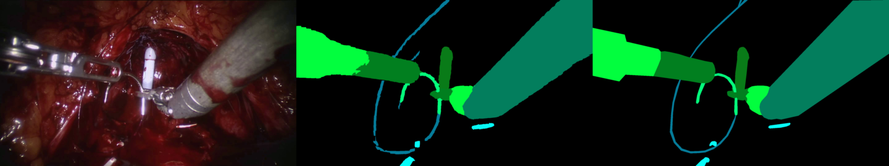

### DinoV3 x SARRAP

I've deside to train an adapter of DinoV3, mainly because I have been meaning to try it out.
LoRA is applied to the ViT attention blocks and dense pixel-wise logits are derive from output token embeddings via a simple MLP.
Loss is weighted per class bases on pixel-wise frequencies.
Images are down sampled to half resolution before inputing to the transformer due to memory concerns.
This is still quite high resolution (960x520), the idea being to preserve fine objects such as thread. 
Loss and Score values are calculated against full resolution maps.

NOTE: DinoV3 is a gated huggingface repo, I've included a token in the code with sufficient permissions. This will be revoked in a week.

## Data Prep
Zip archives extracted in to `sarrarp/train` and `sarrarp/test`.
Video frames extracted into `frames` dir e.g. `sarrarp/train/video_02/video_left.avi` extracted to `sarrarp/train/video_02/frames/000000000.png`
Bash scripts provided to help.

## Environment Prep
Requirements can be installed with
```
pip install -r requirements.txt
```

## Training
Training can be run with the following command...
```
python run_training.py
``` 
At this resolution, and with DinoV3 patch size (16x16) there are a large number of tokens. Training with the default config that requires 30-40Gb of VRAM. To run on a smaller GPU use the `--low-res` flag to run at quater resolution.


## Inference
Inference on the test data split can be run with...
```
python run_inference.py
```
This will produce visulaisations images (rgb, prediction, groundtruth) and prediction masks saved into the model directory e.g. `trained-model/inference/video_41/frames/000000000_pred.png`. Evaluation is also performed during this by calculating mIoU over all samples and averaging. To run only the evaluation use the `--eval-only` flag.

## Conclusion
This model performes pretty well considering the simple adapter used and the speed of training (around 1 epoch). Improvements would likely come from better adapter architecture, likely incorporating skip connection from earlier in the ViT to help guide. Naturally running at full resolution would help however this would require splitting across multiple GPUs and I feel I already have an advantage having a 40GB GPU to hand. I have not explored class-wise scores which would be important for assessing how to improve the model.
